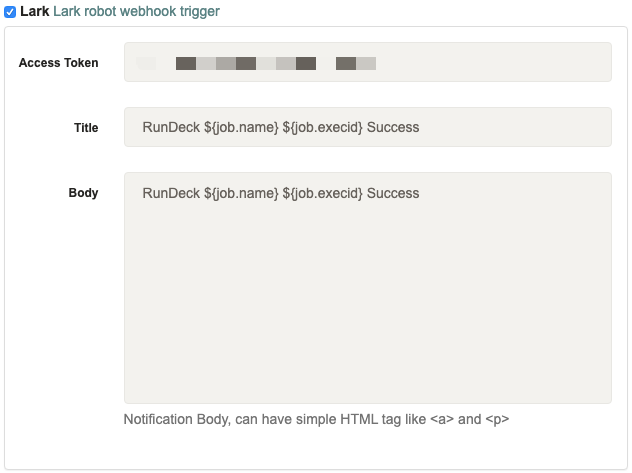

## Rundeck Lark Notification Plugin

[Lark](https://www.feishu.cn/download) Notification Plugin for [Rundeck](https://www.rundeck.com/open-source).

## Build and Deploy

 * Run `gradle jar`
 * Copy `build/libs/rundeck-lark-notification-*.jar` to `RUNDECK_HOME/libexc`
 * Restart rundeckd service `sudo systemctl restart rundeckd`

## Settings

